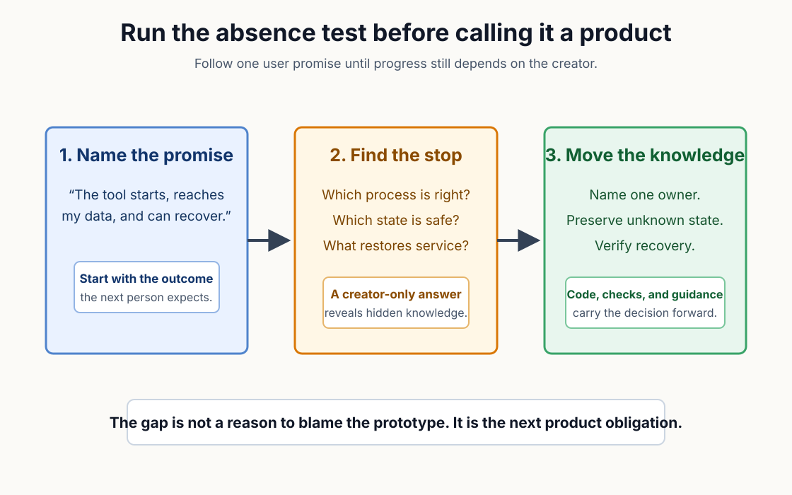
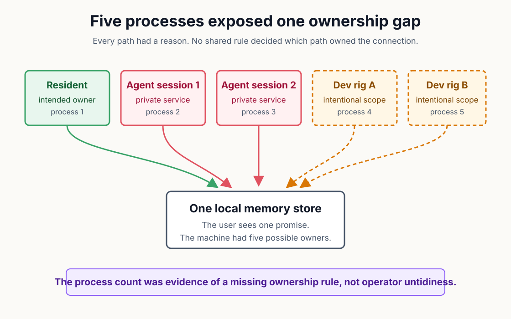
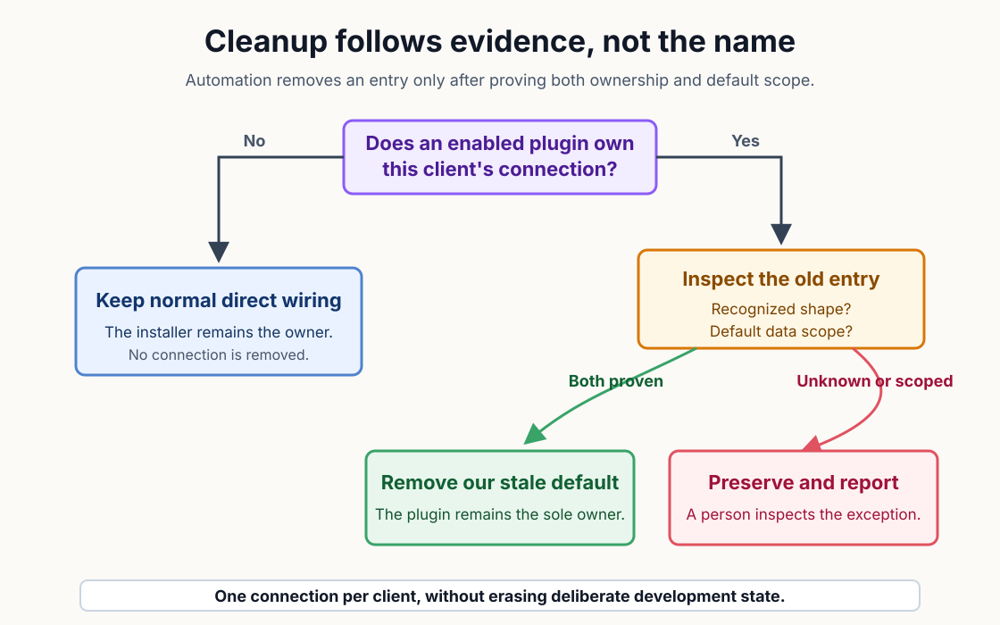

# The Prototype Is Not the Product

Software has carried a warning sentence for years: "It works on my machine." The sentence sounds like success until the person who made the software leaves the room.

The claim can be true while the product is still unfinished. A creator supplies missing instructions without noticing because the right process, warning, and recovery step already live in memory. Another person meets the same software without that invisible support.

The useful question is not whether the prototype works for its creator. Before calling it a product, trace one user promise from setup through failure and recovery. The exercise is an absence test: where would progress stop if the creator could not answer a question? A gap marks knowledge that still needs to move into the system.

AI makes the test more important because the first useful version can arrive in a morning. The spreadsheet taught the earlier version of the same lesson when a workbook that ran one desk failed to become a safe departmental system.

A choice can be reasonable inside the first user's environment. Trouble appears when several reasonable choices meet after the software moves to another machine. Product engineering begins by examining the combination rather than mocking the first decision.

Hidden knowledge usually appears at the handoffs. One detail decides how the software starts, while another decides which copy owns shared state. Recovery depends on knowing what can be removed without damaging a deliberate setup. The creator may perform each decision automatically. The absence test turns those habits into product obligations that another person can inspect.

*The absence test follows one user promise until a decision still depends on the creator, then turns that hidden decision into an explicit product obligation.*

A release-readiness pass exposed this problem in a local memory service for AI tools. The design expected several clients to share one resident process that held the user's memory. The process list showed five service processes instead.

One process was the intended resident. Two live agent sessions had each started another service, and two development rigs supplied the final pair. Every path reflected a real install or development need when viewed alone. Together, the paths had no common owner.

Killing four processes would have produced a cleaner screenshot. The tidy result would not have changed the install paths that created them.

The turn came when the process count stopped looking like operator clutter and started looking like evidence. Two install moments could wire the same client. The command-line installer connected clients to the resident service. The plugin could start a private service for each live session. Development rigs added intentional copies with their own reasons to exist.

Several paths could therefore reach the same local memory estate. Each new session could quietly add another writer beside the resident process. A user saw one memory product but inherited an ownership decision that only the creators understood.

The engineering question changed from "Which processes should we stop?" to "Which path owns this connection?" Ownership had to be decided before cleanup could be safe. Cleanup needed to distinguish a stale default entry from a deliberate development setup. Verification had to prove the user's end state rather than count copied files.

*One intended resident, two session-started services, and two development rigs exposed an ownership rule that no individual install path could enforce alone.*

The resulting method is a five-step absence test for any tool that must leave its creator's desk. The steps are short enough to reuse during release review:

- Name the user promise that must survive the creator's absence.
- Enumerate every install or startup path that can change the same state.
- Assign one owner at each shared handoff.
- Remove only state the product can prove it owns.
- Verify the promise from the user's side, including recovery.

Ownership comes before cleanup because a familiar name is not proof. A named owner gives every installation path the same answer about who creates the connection. Any second path can then defer, repair an older default, or explain why it will not act. A warning is better than a confident deletion when the evidence is incomplete.

Classification protects the boundary between repair and damage. A familiar configuration key may point to the default product or to a development estate with a separate purpose. The safe rule is to preserve any entry that cannot be identified from its command, endpoint, arguments, and data-location overrides.

Cleanup begins by proving that the entry has a shape the installer could have written. A command must resolve to the expected binary, while an HTTP connection must match the default loopback endpoint; otherwise, automation stops. Even a recognized shape remains protected when its arguments or environment select another data location. The classifier preserves malformed or unfamiliar entries because an uncertain name cannot establish ownership. That order narrows automatic removal to the default state the product can actually identify.

The checks make cleanup evidence based. The product can remove a stale default connection while leaving an intentional development path intact.

A reader might reasonably ask whether such ownership detail belongs in an article about prototypes. The answer depends on the promise the software makes. An ownership rule matters when two reasonable setup paths can change the same durable state. The implementation has to make the safe outcome routine before the creator steps away.

The system was MOOTx01, a local memory service shared by AI clients. Current MOOTx01 wiring sends supported clients to one resident daemon instead of giving every session its own estate writer. Clients that require a command bridge still route through that same resident service.

When an enabled plugin owns a client's connection, the command-line installer skips competing direct wiring and checks for an older entry it can safely remove. The binary and resident service still install because the plugin depends on them.

The rule also protects intentional exceptions. A non-default entry may select another data directory or database for development. Removing such an entry would trade duplication for lost isolation. Current code preserves that state and reports the reason for human inspection. Uncertainty therefore stops automation at the boundary where context matters.

AI was useful because it could trace configuration formats, compare install paths, and exercise combinations that are tedious to hold in working memory. It could also find the places where the same client was treated differently. Human judgment defined the user promise and decided that an explainable failure was safer than a hidden second writer. The work became product design when that decision moved from memory into code and tests.

*The installer removes only a recognized default entry; unfamiliar or deliberately scoped connections remain in place for a person to inspect.*

Committed tests exercise the ownership states rather than only the happy path. One case keeps normal wiring when no enabled plugin owns the client. Another removes a prior default entry when the plugin takes ownership and preserves a development entry carrying a separate data location.

The observable consequence is convergence across install order. A user no longer needs to remember whether the binary or plugin arrived first to obtain one connection path per client.

A fair complication remains: one resident service is a product rule, not a universal law of local software. Some teams deliberately run isolated development estates or several versions at once. The ownership classifier respects that possibility by refusing to equate every familiar-looking entry with stale state. The broader method survives because it asks the product to prove ownership before acting.

Repository readers can apply the same test to migrations, background jobs, caches, and credentials. Follow one user promise across every path that can create or change its state. Ask where the correct choice still depends on knowing the experiment's history.

Fast creation moved the bottleneck from proving that a path exists to proving that another person can use it safely. Dependable software begins when the system carries enough of the creator's knowledge to survive the creator's absence.

## Sources
1. MOOTx01 maintainers, ["ADR-024: MCP connection ownership, plugin transport, and install-moment dedupe"](https://github.com/codedaptive/mootx01-ce/blob/be3731d2/docs/decisions/ADR-024-mcp-connection-ownership-and-install-dedupe.md), July 4, 2026. The record documents the five-process field finding, the two install moments, the single-writer risk, and the ownership decision.

2. MOOTx01 maintainers, [unified CLI overview](https://github.com/codedaptive/mootx01-ce/blob/develop/1.0.x/apps/mootx01/README.md), current resident-daemon and client-wiring behavior.

3. MOOTx01 maintainers, [CE install surface](https://github.com/codedaptive/mootx01-ce/blob/develop/1.0.x/docs/start-here/INSTALL_SURFACE.md), current product-install goal, local addresses, verification path, and single-writer guidance.

4. MOOTx01 maintainers, [`MCPEntryOwnership.swift`](https://github.com/codedaptive/mootx01-ce/blob/develop/1.0.x/apps/mootx01/Sources/MootInstallerCore/MCPEntryOwnership.swift), current shape checks, override classification, and preserve-unknown behavior.

5. MOOTx01 maintainers, [`InstallCommand.swift`](https://github.com/codedaptive/mootx01-ce/blob/develop/1.0.x/apps/mootx01/Sources/mootx01/Commands/InstallCommand.swift), current enabled-plugin ownership path and direct-entry dedupe call.

6. MOOTx01 maintainers, [`PluginDedupeTests.swift`](https://github.com/codedaptive/mootx01-ce/blob/develop/1.0.x/apps/mootx01/Tests/MootInstallerCoreTests/PluginDedupeTests.swift), committed coverage for plugin absence, prior default entries, and preserved non-default entries.

---

[Series index](../README.md) | [Business edition](../business/01-the-prototype-is-not-the-product.md) | [Next: You Still Have to Write the Manual →](02-you-still-have-to-write-the-manual.md)

Originally published on [Off-Axis Labs](https://offaxislabs.io/p/the-prototype-is-not-the-product) on 2026-07-07. Revised for this repository on 2026-07-22.

Copyright 2026 Codedaptive LLC. Article text licensed under [CC BY 4.0](https://creativecommons.org/licenses/by/4.0/).
