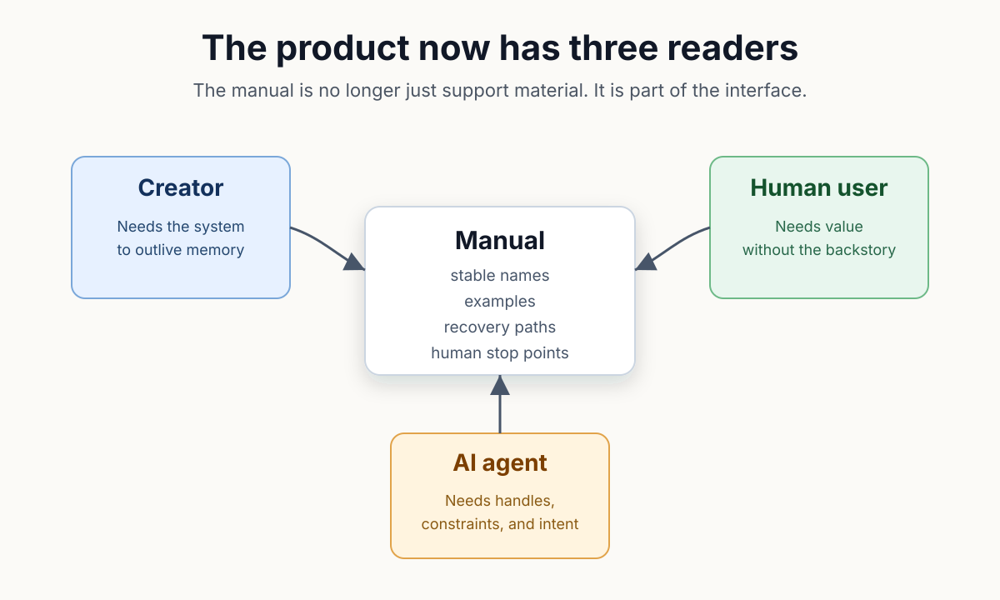
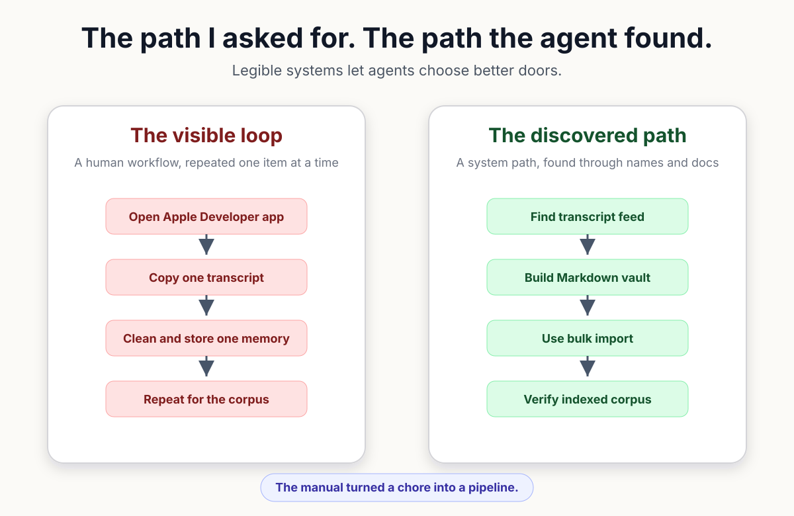
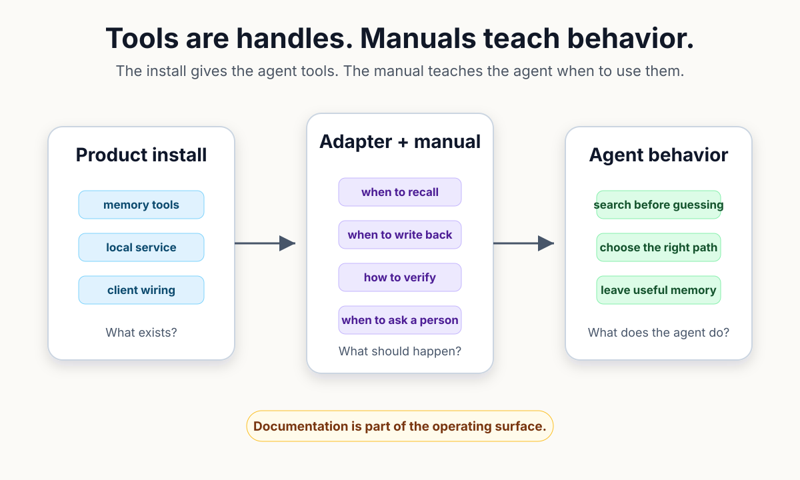

# You Still Have to Write the Manual

A developer gives an agent a valid command and asks it to process a large collection. The agent can repeat the command hundreds of times, so the plan appears complete. Only after the run begins does the cost become visible: the product had a bulk path, but nothing in the request taught the agent to look for it. A technically correct workflow has become an avoidable tax.

The missing information belongs to the product. A command schema can describe accepted arguments without explaining when the command is the wrong choice. Agent-operated software therefore needs documentation that teaches selection and verification, not merely syntax.

What must the manual expose so an agent can find a better route without guessing past the user's authority? The answer begins with the readers who now depend on the same text.

For years, software teams joked that users would not read the manual. A few people always did, especially when recovery mattered. Many others arrived after an error had already consumed their patience, which made documentation feel necessary and thankless.

Agents change the return on that work. The creator needs a durable explanation, the human user needs a safe path, and the agent needs stable handles connected to intent. One manual can now improve all three experiences when it treats their decisions separately.

*The same manual serves three readers, but each reader needs a different kind of clarity.*

A tool inventory is only the beginning. Names tell an agent what exists, while schemas constrain input shape. Neither one explains relative cost, whether an operation changes state, or which result proves the job finished.

Operating guidance connects those missing facts; a bulk import should say what source shape it expects, how to observe progress, and which check confirms that indexing completed. A destructive path should say what it changes and where a person must approve.

The difference became visible during an import of Apple Developer conference transcripts. My initial plan used the path closest to the user interface. Extract one session, clean the text, file one memory, and repeat. Every step was valid, yet the sequence moved a collection through an operation intended for individual records.

Before starting the loop, the agent inspected the local source and the available documentation. The transcripts already existed as text, and the memory product accepted a Markdown vault as a bulk source. Those two facts had not been joined in my request.

Recognition changed the work; the agent prepared the corpus as a vault, invoked the bulk path, and verified the imported collection after the background work settled. Repetition became preparation followed by one observable job.

*The better route appeared when source structure, bulk capability, and a verification step were visible together.*

The agent did not need a cleverness claim. Product legibility supplied the decisive advantage: stable names, a documented source format, and a finish line. Better reasoning could then operate inside a system whose useful doors were visible.

Documentation becomes part of the interface at that point; a button guides a person through placement and state while an operating manual guides an agent through purpose and consequence. Both affect the path the product makes likely.

A useful agent-facing manual lets the reader retain five independent answers:

- the normal path and its intended scale;
- the cheaper or safer alternative;
- the operations that mutate state;
- the evidence that proves completion; and
- the decision that still requires a person.

No manual can predict every discovery. Excessive internal detail can bury the few distinctions an agent needs. Rigid instructions can also suppress a legitimate better route. The documentation should therefore explain decisions and boundaries, leaving implementation detail available as evidence rather than forcing it into the first plan.

Writing those instructions also tests the product. A workflow that requires three paragraphs of exceptions may need a different command. Recovery that works only for the original developer reveals knowledge the product has not yet absorbed.

MOOTx01 supplied the public implementation behind the transcript incident; its agent guide separates individual filing from `moot_vault_import`, warns that bulk work may be long-running, and directs the agent to poll the job before checking the estate map. Normal imports start their own indexing work, so the guide also prevents an unnecessary recovery reindex.

The adapter documentation makes another distinction. Installing the runtime gives an AI client tools. Installing the matching adapter teaches the client when to use them. A successful setup therefore checks both reachability and behavior. Recall should come before guessing, and durable decisions should be written back; bulk work should be verified rather than treated as complete because the first search returned something.

Verification closes the causal loop. A job result shows that the import process ended, and the estate map shows that the collection landed where expected. Search and synthesis become reasonable only after the imported material is available to the indexes that support them.

*Installation exposes capability; documentation turns that capability into repeatable operating behavior.*

The manual still cannot guarantee good judgment. An agent can misread a boundary, source data can be wrong, and a documented bulk path can be inappropriate for a small correction. Clear stop points matter because capability should not be mistaken for authority.

AI can help keep the manual aligned with code by comparing command names, testing examples, and locating stale recovery steps. Human review decides which workflow is ordinary, which cost deserves warning, and which evidence is enough to call the work complete.

The old documentation joke has changed. Users may continue to skip most manuals, but their agents will search whatever the product makes available. Every missing distinction can therefore become a repeated machine action, while every useful distinction can guide many sessions.

You still have to write the manual, and the technical standard is higher now. Teach scale, state, verification, recovery, and human authority in terms an agent can connect to its next action. The product becomes dependable when its best operating knowledge no longer depends on the creator being present.

Off-Axis Labs: All the science, fewer casualties.

## Sources
1. MOOTx01 maintainers, "How To Use MOOTx01," `apps/moot-agent-skills/shared/HOW_TO_USE_MOOTX01.md`, especially "Writing Memory," "Vaults And Source Material," and "Cost Discipline."

2. MOOTx01 maintainers, "MOOTx01 Agent Adapters," `apps/moot-agent-skills/README.md`, especially "Install Order" and "Test Prompts."

3. MOOTx01 maintainers, "MOOTx01 Session Ritual," `apps/moot-agent-skills/shared/MOOTX01_SESSION_RITUAL.md`, especially "After Bulk Ingest."

4. MOOTx01 maintainers, "AI Start Here," `AI_START_HERE.md`, public orientation for agents entering the repository.

5. Bob Pankratz, "You Still Have to Write the Manual," Off-Axis Labs, July 9, 2026, https://offaxislabs.io/p/you-still-have-to-write-the-manual.

---

[← Previous: The Prototype Is Not the Product](01-the-prototype-is-not-the-product.md) | [Series index](../README.md) | [Business edition](../business/02-you-still-have-to-write-the-manual.md) | [Next: Installing Software Used to Be an Event →](03-the-installer-is-part-of-the-product.md)

Originally published on [Off-Axis Labs](https://offaxislabs.io/p/you-still-have-to-write-the-manual) on 2026-07-09. Revised for this repository on 2026-07-22.

Copyright 2026 Codedaptive LLC. Article text licensed under [CC BY 4.0](https://creativecommons.org/licenses/by/4.0/).
