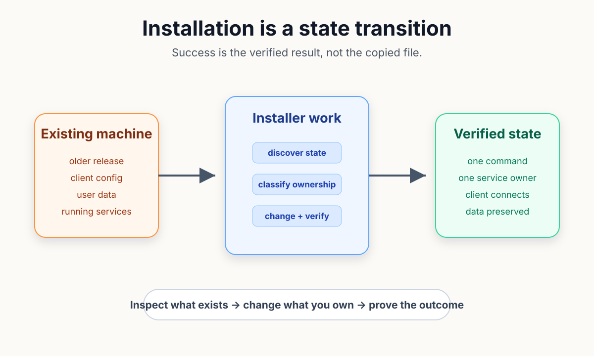
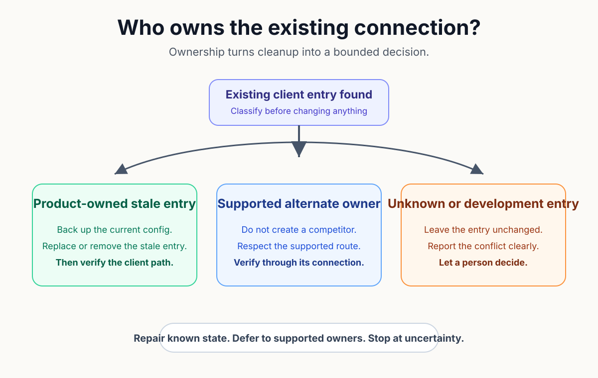
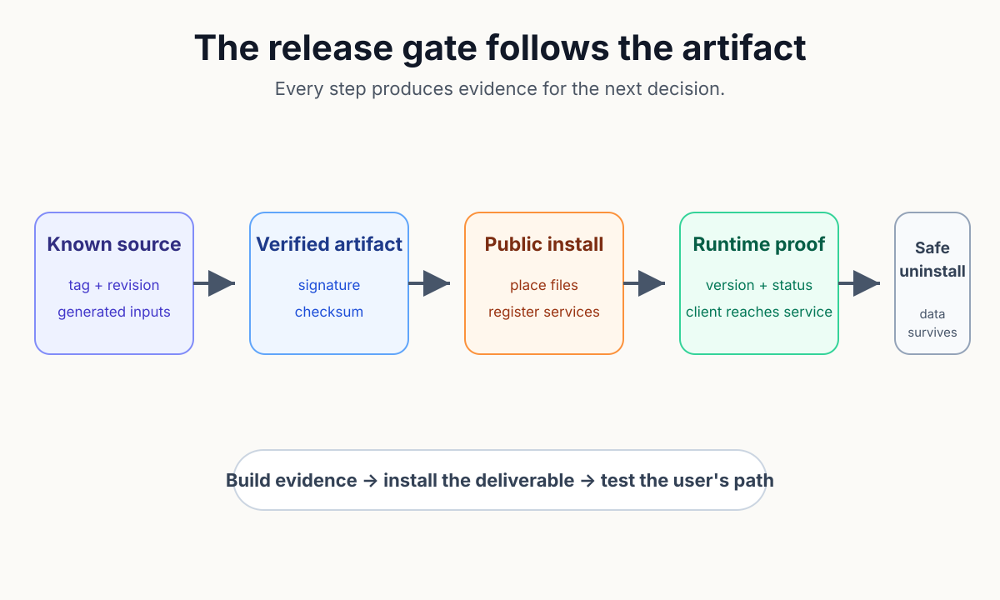

# Installing Software Used to Be an Event

Installing software used to be an event. A box held disks and a guide, the machine copied files long enough to command attention, and a restart left a brief question about whether the computer would return. The ceremony made the change visible.

Modern installation asks for fewer clicks while reaching into more of the machine; one command may place a binary, register a service, merge client configuration, assign permissions, and preserve data from an older release. A quiet installer can therefore fail in several places after reporting that the file copy succeeded.

The engineering question is not how quickly an installer can finish. A product install needs a defined end state. Reaching that state from several starting conditions needs a method and evidence that the user's path works. What should the installer own, verify, and leave alone?

A first prototype usually has an easy answer because the developer supplies missing state by hand. The current binary lives in a known directory, one test machine has the right configuration, and a terminal remains open to explain warnings. Delivery feels like a copy operation while the creator is acting as the rest of the installer.

Product installation begins when that private assistance disappears; the machine may contain an older release, a development build, a stopped service, or config written by another supported route. Installation has to negotiate with that history rather than assume an empty computer.

*A dependable installer moves an unknown but inspectable machine toward a verified state instead of treating file placement as completion.*

The target state should be written before the scripts. A useful contract names the callable command, the service that should answer, the clients that should connect, the data that must survive, and the status check a user can run. Each sentence creates a testable obligation.

Reinstall then becomes a convergence test; running the same supported installer twice should produce one working product rather than a second daemon or another config entry. Idempotent file operations help, but convergence also requires an ownership decision for state that already exists.

Ownership separates repair from damage. A stale entry bearing the product's identity may be replaced safely. A supported plugin that currently owns the connection may deserve deference. An unfamiliar development entry should be reported because deleting it would turn uncertainty into an unauthorized action.

Those branches cannot be replaced by a broad cleanup command. An installer that never removes its stale work accumulates every experiment the project shipped, while an installer that removes everything unfamiliar can break a working machine. Recognizing its own footprints is part of the product model.

Uninstall applies the same distinction in reverse; product wiring, service registration, and installed binaries belong to the package. User-created data belongs to the user unless a separate, explicit purge decision says otherwise.

The contract can be retained as one compact checklist:

- discover existing state before mutation;
- change only product-owned or explicitly approved state;
- verify through the same path the user will use; and
- preserve user data unless removal is separately confirmed.

*Connection cleanup becomes safe only after the installer distinguishes its own stale state, another supported owner, and an unknown entry.*

Release automation has to prove those statements with the shipped artifact. Compilation and unit tests establish important facts about source, yet neither test whether the public package placed the right files or registered the right services. The release gate must cross the same boundary the user crosses.

One candidate release exposed that gap; the build existed and its internal tests passed, but the useful question was whether the installer could land the artifact, wire the resident pieces, run the installed command, and remove the product cleanly. Treating those steps as a separate manual check would have repeated the creator-wrapped prototype at release time.

Recognition changed the gate. The candidate workflow began by installing the built package on a fresh runner. It asked the installed command for its version, checked the registered services, and exercised uninstall. A future release now has to reproduce the public outcome before promotion.

MOOTx01 is the product behind that incident. Its CE install contract names the command, local estate, AI client wiring, resident daemon, management dashboard, and verification result that a product install should leave behind. The defaults also keep the services on loopback addresses so verification does not silently widen network reach.

The current candidate workflow checks more than file presence. On macOS it verifies the resident daemon. The management console registration receives its own check. Other runners install, run, and uninstall through their public routes. The release runbook then requires channel checks after signed artifacts attach.

Data retention is explicit in the same surface; a normal `mootx01 uninstall` leaves estate databases and manager history in place. Purge requires an additional option and confirmation, and interactive removal moves data to the platform trash rather than hard-deleting it.

*The release gate follows the artifact beyond the build and asks the installed product to prove the user-visible path.*

No automated matrix can cover every lived-in machine. An interrupted upgrade, a hand-edited config, or a service owned by an unknown process may still require a person. Good automation narrows that uncertainty and stops with evidence instead of pretending to understand state it cannot classify.

AI can maintain much of the evidence loop; an agent can compare install docs with code, trace which components mutate config, and replay candidate checks across platforms. Human judgment determines the authority boundary: which state may be repaired automatically, which conflict needs consent, and which data must survive.

The installer is the first executable promise a product makes on a machine it does not own. Stable paths and signatures matter. The deeper obligation is convergence toward a state the user can verify and reverse. Installation becomes dependable when success means more than the newest files arrived.

Off-Axis Labs: All the science, fewer casualties.

## Sources
1. MOOTx01 maintainers, "MOOTx01 CE Install Surface," `docs/start-here/INSTALL_SURFACE.md`, especially "Product Install Goal," "Verification Checklist," and "Uninstall Or Disable."

2. MOOTx01 maintainers, candidate release workflow, `.github/workflows/candidate.yml`, installer build and install-verification jobs.

3. MOOTx01 maintainers, "Release Runbook," `docs/engineering/RELEASE_RUNBOOK.md`, tagged build, channel publication, and verification gates.

4. MOOTx01 maintainers, `apps/mootx01/Sources/mootx01/Commands/InstallCommand.swift`, install flow and client-wiring convergence.

5. MOOTx01 maintainers, `apps/mootx01/Sources/MootInstallerCore/MCPEntryOwnership.swift`, ownership classification used during client configuration.

6. MOOTx01 maintainers, `apps/mootx01/Sources/mootx01/Commands/UninstallCommand.swift` and `apps/mootx01/Sources/MootInstallerCore/DataRetention.swift`, uninstall and recoverable data-removal behavior.

7. Bob Pankratz, "Installing Software Used to Be an Event," Off-Axis Labs, July 14, 2026, https://offaxislabs.io/p/installing-software-used-to-be-an.

---

[← Previous: You Still Have to Write the Manual](02-you-still-have-to-write-the-manual.md) | [Series index](../README.md) | [Business edition](../business/03-the-installer-is-part-of-the-product.md) | [Next: Security Boundaries Are Product Design →](04-security-boundaries-are-product-design.md)

Originally published on [Off-Axis Labs](https://offaxislabs.io/p/installing-software-used-to-be-an) on 2026-07-14. Revised for this repository on 2026-07-22.

Copyright 2026 Codedaptive LLC. Article text licensed under [CC BY 4.0](https://creativecommons.org/licenses/by/4.0/).
