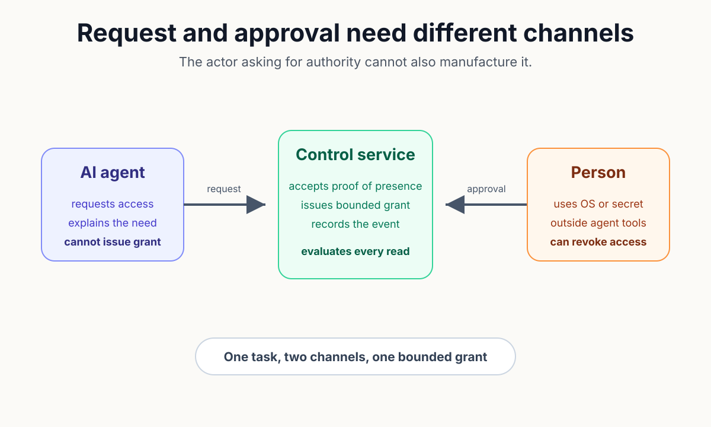
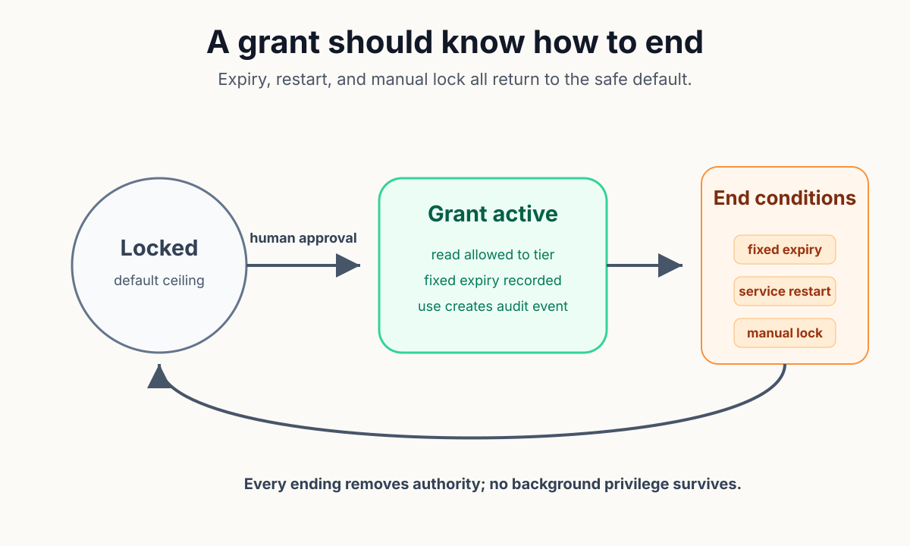
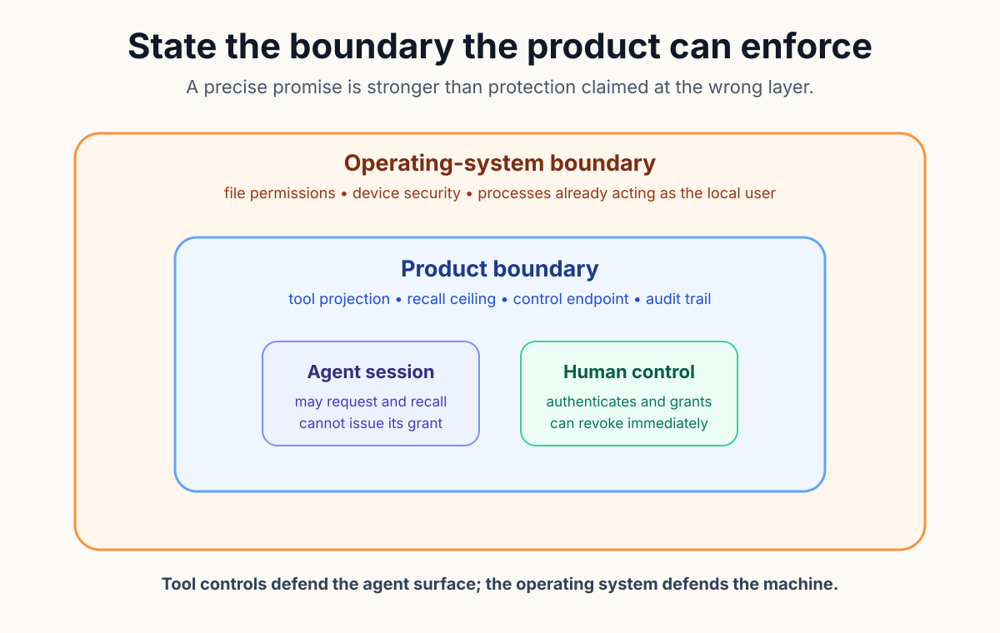

# Security Boundaries Are Product Design

An agent asks to read a protected record, and the user approves the request in the same conversation. The implementation looks direct: expose an `unlock` tool, wait for the person to say yes, then let the model call the tool. Convenience has placed the request and the grant in one actor's reach.

Prompt injection turns that convenience into a security problem; the agent reads email, pages, code, and documents that may contain hostile or misleading instructions. If the same model can manufacture the grant, a malicious passage can pursue the approved handle instead of breaking the underlying storage.

The technical question must therefore cover reach as well as policy. Which actor requests the action? Which channel proves user presence, and which component issues the temporary capability? A boundary exists only when the requesting actor cannot satisfy its own approval condition.

This problem resembles multifactor login. A password and phone prompt add protection because compromise of the first channel does not control the second. Putting both factors behind one callable interface would preserve the clicks while removing the separation.

Agent tools deserve the same scrutiny; tool schemas constrain how a model asks for an action, but the presence of the tool still grants reach. A system prompt saying "call this only after approval" is weaker than a product surface on which the grant action does not exist.

*The agent may carry the request, but a separate human-controlled channel must create the grant.*

A useful design begins with actors rather than endpoints. The model requests data, the user proves presence, the control service creates a grant, and the data service evaluates the grant on each read. Keeping those roles explicit makes hidden shortcuts easier to find.

OWASP calls the broader failure excessive agency; damage becomes possible when an LLM receives more functions, permissions, or autonomy than the intended task requires. Minimizing the available function set and enforcing authorization downstream reduce the impact of manipulated model output.

Removal of the grant tool solves only the first problem. Approval can still linger after the user forgets it. Grant lifetime therefore becomes another part of the surface. A fixed window limits how long later prompts can reuse yesterday's consent.

Restart behavior matters for the same reason. Persisting a sensitive grant turns a service restart into an invisible privilege restore. Keeping the grant in process memory makes restart return the system to the locked state without a separate cleanup path.

Audit completes the control loop; a useful event records that approval was issued, denied, revoked, or used, but it should not copy the protected content into the log. Security evidence must not become a second disclosure channel.

The implementation review can retain four checks:

- no agent-callable operation creates or widens the grant;
- approval crosses a user-controlled channel;
- expiry and restart return access to the default ceiling; and
- audit records the event without reproducing sensitive content.

*A temporary grant has a birth, a bounded lifetime, and several fail-closed ways to end.*

Security claims also need a declared threat boundary. A tool-level control can defend against a model that calls only the exposed interface. The same control cannot stop a hostile process already running with permission to read the underlying database file.

That limit changes how the feature should be described; the product can block fast self-service escalation through its agent surface, redact protected content by default, and record use under a grant. Operating-system permissions and device security remain responsible for code that already acts as the local user.

Portability creates a related tension. Bulk import and export help owners inspect, back up, and move their data. The same operations can become fast paths into or out of the protected store. A safe design treats bulk movement as a distinct capability rather than assuming ordinary recall policy covers it.

MOOTx01 implemented the agent boundary by excluding restricted and secret rows from ordinary recall and omitting any lock or unlock verb from the MCP tool projection. The separate `mootx01 unlock` command performs local user authentication on macOS, then calls a loopback control endpoint outside the model's tool list. Linux and Windows use a password-based approval path in the Rust implementation.

The resident service stores grants only in memory. Private access expires at the next local midnight. Secret access lasts a fixed thirty minutes. The `mootx01 lock` command clears both immediately. Construction of a fresh grant ledger means service restart begins locked.

Reads under a live grant create dedicated audit events; search previews for restricted and secret content remain redacted without the needed access, and parity tests cover both implementation ports. A separate test enumerates every exposed MCP tool and fails if an unlock-shaped name appears.

*The product boundary governs agent tools and local control calls; the operating system governs processes already acting as the user.*

These controls do not promise that recalled content can never leave the machine. Once the owner lets an AI client read a memory, that client may send the content to its model provider. The privacy policy names the handoff because the memory service can control its own channels, not every downstream conversation.

AI can assist the review by enumerating tools, tracing grant creation, and comparing Swift and Rust behavior. Human judgment defines the protected action, acceptable friction, and the point where a user must appear outside the agent's channel.

A security boundary is product design because absence, lifetime, and recovery shape the normal workflow. The strongest message is not a warning displayed before an overpowered tool. The stronger product has removed that tool from the actor who should never hold it.

Off-Axis Labs: All the science, fewer casualties.

## Sources
1. OWASP Foundation, "LLM06:2025 Excessive Agency," https://genai.owasp.org/llmrisk/llm062025-excessive-agency/.

2. MOOTx01 maintainers, "Security Policy," `SECURITY.md`, especially "Security by construction" and "What this does not defend against."

3. MOOTx01 maintainers, "MOOTx01 Privacy Policy," `PRIVACY.md`, local storage, network connections, and AI-client handoff.

4. MOOTx01 maintainers, `apps/mootx01/Sources/mootx01/Commands/UnlockCommand.swift` and `apps/mootx01/Sources/mootx01/UnlockAuthority.swift`, out-of-band macOS approval.

5. MOOTx01 maintainers, `packages/kits/AriaMcpKit/Sources/AriaMCP/SensitivityGrantLedger.swift`, in-memory grants and expiry behavior.

6. MOOTx01 maintainers, `packages/kits/AriaMcpKit/Tests/AriaMCPTests/ToolProjectionTests.swift`, forbidden lock and unlock tool names.

7. MOOTx01 maintainers, `packages/kits/AriaMcpKit/Tests/AriaMCPTests/SensitivityUnlockIntegrationTests.swift` and `SearchRedactionTests.swift`, recall ceilings, expiry, restart, audit, and preview redaction.

8. Bob Pankratz, "Security Boundaries Are Product Design," Off-Axis Labs, July 16, 2026, https://offaxislabs.io/p/security-boundaries-are-product-design.

---

[← Previous: Installing Software Used to Be an Event](03-the-installer-is-part-of-the-product.md) | [Series index](../README.md) | [Business edition](../business/04-security-boundaries-are-product-design.md) | [Next: Same Memory Commands. Safer Memory Records. →](06-same-memory-commands-safer-memory-records.md)

Originally published on [Off-Axis Labs](https://offaxislabs.io/p/security-boundaries-are-product-design) on 2026-07-16. Revised for this repository on 2026-07-22.

Copyright 2026 Codedaptive LLC. Article text licensed under [CC BY 4.0](https://creativecommons.org/licenses/by/4.0/).
