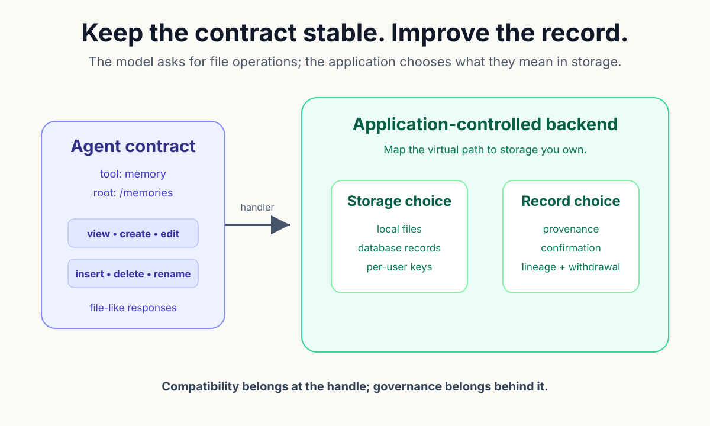
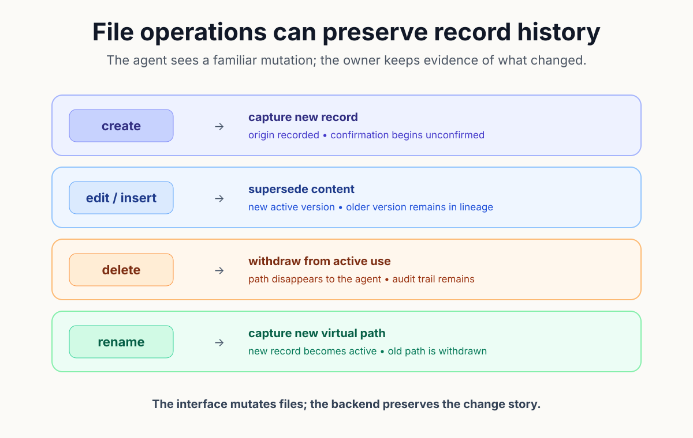
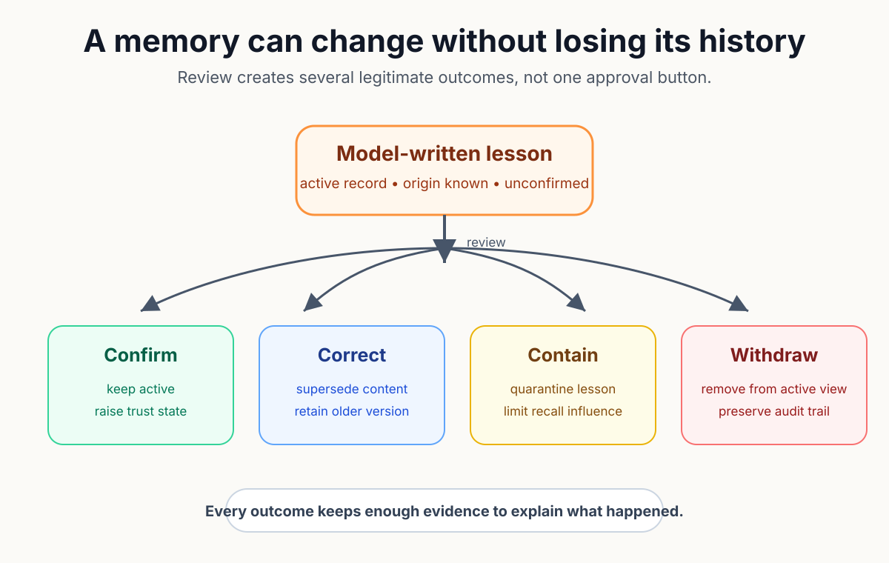

# Same Memory Commands. Safer Memory Records.

An agent writes a lesson to `/memories/deploy.md`: always restart the service after changing configuration. The file returns in a later conversation, and the next agent follows it. No field says whether the model inferred the rule, whether a person confirmed it, or which release made it obsolete.

Persistence has worked exactly as designed while trust has not; stored text answers what the agent can read, but a durable operating lesson also needs origin, review state, change history, and a reversible way to leave active use. Without those facts, yesterday's shortcut can become tomorrow's policy.

The implementation question is how to add that record without taking away the interface agents already understand. A stable tool contract solves one problem. A richer storage model solves another. Keeping them separate lets compatibility survive while governance improves behind the handle.

Anthropic's memory tool makes the separation explicit. Claude receives a client-side tool named `memory`, operates under `/memories`, and requests file-like work that the application executes. The application controls the actual storage and must restrict operations to the memory root.

That contract gives an agent six operations: `view`, `create`, `str_replace`, `insert`, `delete`, and `rename`; directory listings and line-numbered file views make the surface familiar, while the handler remains free to map the virtual path to a directory, database key, or another store. The model does not need to learn the physical backend.

*The agent keeps a file-shaped contract while the application chooses the storage and record semantics behind it.*

Fable 5 increased the pressure on that seam. Anthropic reported that persistent file-based memory improved Fable's performance in a long-running game and that the model uses its own notes across extended work. Better use of memory raises the consequence of every note the system allows to persist.

A flat file remains a valid backend for many applications; the format is inspectable, portable, and easy to prototype. Risk appears when the file begins carrying decisions whose authority cannot be reconstructed from the text.

Consider an edit. Replacing one line in a file produces the new content. The ordinary result does not say which version the next agent should trust or why the old line changed. A governed record can preserve both versions and the relationship between them without changing the agent's `str_replace` request.

Deletion reveals the same distinction. Removing a path from the active view may be the correct agent experience, yet hard deletion destroys the evidence needed to review a poisoning incident or restore a mistaken cleanup. Soft withdrawal can hide the lesson from recall while keeping its lineage.

Create also carries a trust decision; a model-generated lesson can be useful immediately and still deserve a visible unconfirmed state. Review can then promote, correct, or contain the write without treating every agent observation as an owner-approved rule.

The backend needs a behavioral mapping rather than a feature inventory:

- create captures an unconfirmed record with origin;
- edit supersedes content while preserving lineage;
- delete withdraws the active record without hard erasure; and
- rename creates the new virtual path while retiring the old one.

*Familiar file operations can become record events that preserve confirmation state and lineage.*

Security still begins at the virtual filesystem boundary. The handler must reject traversal outside `/memories`, encoded attempts to escape, and hidden paths the interface does not support. Size limits keep one write from turning the memory operation into an unbounded payload channel.

These controls do not make the remembered content correct; provenance can show that a model wrote a lesson, but it cannot prove the lesson deserves trust. Recordkeeping creates the evidence for review rather than replacing review.

Compatibility also has a cost. A file-shaped response cannot expose every governance concept without surprising the agent. Existing clients still expect Anthropic's format. Rich inspection therefore belongs on a separate owner surface, while the memory tool stays focused on the contract it implements.

MOOTx01 applies that design in its memory adapter. The Python handler dispatches the six commands, validates every path against `/memories`, rejects dotfiles and traversal, and enforces a 100-kilobyte create limit. Requests then travel to the local MCP service for execution against the estate.

The estate maps `create` to an unconfirmed drawer. The `str_replace` and `insert` operations supersede prior content. A `delete` performs a soft withdrawal. The `rename` operation captures at the new virtual location before withdrawing the old one. Finally, `view` reconstructs directory and line-numbered file responses from active records.

The visible behavior stays compatible; Claude asks for the same path and operation it would use with another memory handler, while the owner retains provenance, confirmation state, lineage, sensitivity, and audit history. A mistake can leave circulation without disappearing from the record of what happened.

*A model-written lesson can move from unconfirmed to trusted, corrected, contained, or withdrawn without losing its history.*

The test surface covers the compatibility boundary directly. Client-side tests reject paths outside the memory root, encoded traversal, hidden components, unknown commands, and oversized files. End-to-end tests exercise all six operations against a live service, including the fact that withdrawn content disappears from the active view.

One limitation remains important; the current poisoning test proves that a model-written lesson can be filed and withdrawn, but review policy still determines when an unconfirmed memory may influence later recall. A deployment should make that policy explicit rather than infer safety from the presence of an audit trail.

AI can use the compact interface without understanding every event in the estate. People can inspect the richer record when a decision becomes consequential. Governance processes can do the same. Separating those readers keeps ordinary memory work cheap while preserving a path to accountability.

Same memory commands can support safer memory records because the contract describes requests, not the whole storage model. Keep the interface stable, map mutations to reviewable events, and give the owner a way to confirm, correct, contain, or withdraw what the agent wrote. Persistence becomes dependable when the record can explain how belief changed.

Off-Axis Labs: All the science, fewer casualties.

## Sources
1. Anthropic, "Memory tool," Claude Platform Docs, https://platform.claude.com/docs/en/agents-and-tools/tool-use/memory-tool.

2. Anthropic, "Tool reference," Claude Platform Docs, https://platform.claude.com/docs/en/agents-and-tools/tool-use/tool-reference.

3. Anthropic, "Claude Fable 5 and Claude Mythos 5," June 9, 2026, https://www.anthropic.com/news/claude-fable-5-mythos-5.

4. Anthropic, "Redeploying Fable 5," June 30, 2026, https://www.anthropic.com/news/redeploying-fable-5.

5. MOOTx01 maintainers, "MOOTx01 Memory Adapter," `apps/moot-memory-adapter/README.md`, operation mapping and security properties.

6. MOOTx01 maintainers, `apps/moot-memory-adapter/moot_memory/moot_memory.py`, command dispatch, path checks, size cap, and SDK integration.

7. MOOTx01 maintainers, `apps/moot-memory-adapter/tests/test_memory_adapter.py`, path-validation, operation, and poisoning-quarantine tests.

8. MOOTx01 maintainers, release `v1.0.25`, https://github.com/codedaptive/mootx01-ce/releases/tag/v1.0.25.

9. Bob Pankratz, "Same Memory Commands. Safer Memory Records.," Off-Axis Labs, July 9, 2026, https://offaxislabs.io/p/same-memory-commands-safer-memory.

---

[← Previous: Security Boundaries Are Product Design](04-security-boundaries-are-product-design.md) | [Series index](../README.md) | [Business edition](../business/06-same-memory-commands-safer-memory-records.md)

Originally published on [Off-Axis Labs](https://offaxislabs.io/p/same-memory-commands-safer-memory) on 2026-07-09. Revised for this repository on 2026-07-22.

Copyright 2026 Codedaptive LLC. Article text licensed under [CC BY 4.0](https://creativecommons.org/licenses/by/4.0/).
