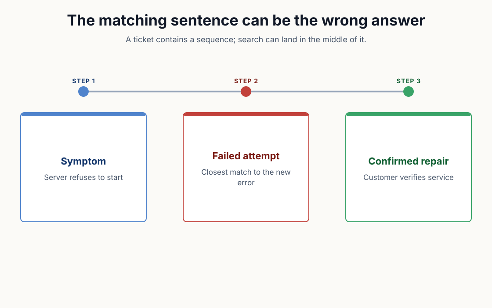
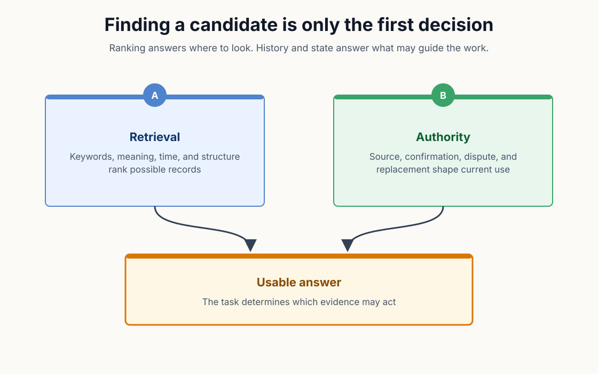
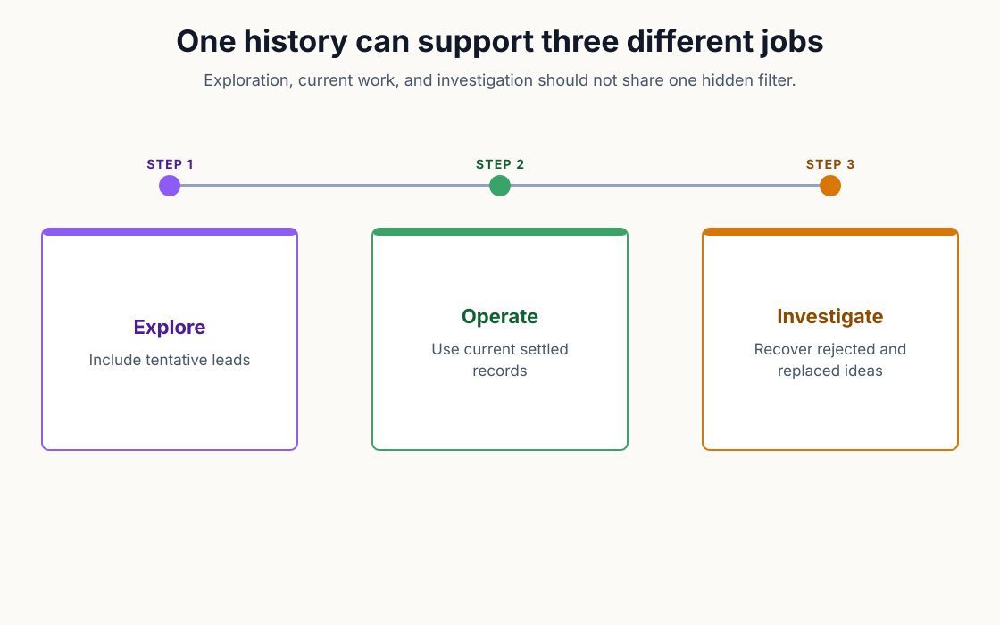

# Search Found the Right Ticket—and the Wrong Answer

## The Answer Was in the Ticket

For nineteen years I ran a managed services company. We kept tickets because the small details of yesterday's problem often saved someone from repeating the work tomorrow.

A useful ticket might begin with a server refusing to start. The technician would record the error, try the most likely repair, discover that it did not work, and try something else. By the end, the same ticket contained the symptom, the failed attempt, and the change that restored the service.

Months later another technician could search for the error and find that history. The exact words were there. So were two different answers.

Search had done its job by finding the ticket. It could not decide which paragraph deserved to guide the repair.

People handle this problem almost without noticing. We read around the matching sentence. A phrase such as "that did not work" marks the failed step. The final resolution, date, author, and customer confirmation reveal how the incident ended.

An AI agent can also read those clues, but only if the system returns them and the workflow gives them meaning. If memory is treated as a folder of text with a search box in front of it, the matching passage can arrive alone. The failed attempt may share more words with the new error than the successful repair does.

The top result will look like an answer because that is what search results have trained us to expect.

*The words that match the next incident may belong to the repair that failed, which is why the sequence around the match remains part of the answer.*

## Resemblance Is Useful

Search begins with resemblance. A keyword engine rewards shared terms. A semantic engine can find passages that express similar ideas with different words. A hybrid system combines several signals and tries to place the most useful candidates near the top.

That is difficult work, and it matters. A perfect record buried at result 400 may as well be missing when an agent has a limited context window and a task waiting for an answer.

We spent a great deal of time on this part of our memory system. Ordinary memory search casts a broad net. Precise recall helps when the question contains a path, version, number, or proper name that separates one record from several near-duplicates. Shaped recall can favor literal language, concepts, structure, time, or associations depending on the job.

The Git history records the usual progression. Search modes improved first, followed by a discrimination signal that classifies the relative gap between the leading result and its neighbors — and applies a saturation discount when the semantic lane did not contribute. A narrow relative gap, or a result ranked on lexical signals alone, should be treated as an uncertain set, even when the interface has placed one row at the top.

The important sentence appears in the source code itself: the discrimination value is a relative-gap confidence estimate, not a guarantee about which result is best. For the person reading the result, the signal has one more boundary: it says nothing about truth.

A clear winner means the search system found one candidate that resembles the question much more than its neighbors. The winner may still be an abandoned experiment or a rejected proposal. An unconfirmed observation or a rule written for another customer can win the same ranking.

Better search improves the quality of the question presented to judgment. Judgment remains necessary.

## The Difference Appears When the Agent Can Act

This distinction has always mattered in documentation, ticketing systems, and email archives. AI raises the stakes because the reader can now act before a person sees what it read.

Suppose an agent is preparing a release and asks memory how to handle a failing test service. Search returns a precise instruction to bypass the check. The instruction came from a real incident, contains the current service name, and ranks far above the other results.

Several facts remain unknown. Was the bypass a temporary workaround? Did a person confirm it? Did another record replace it after the service returned? Does the instruction belong to this release process or an older one with the same name?

The search score cannot answer those questions because they are not questions about resemblance.

This is the blind spot behind many early memory systems. The first goal is to end the cold start. Give the agent a place to write, index what accumulates, and bring relevant text back into later sessions. The improvement is immediate because useful work no longer disappears when the context window fills.

Once the recalled material begins directing action, the job changes. The system is no longer helping the agent find notes. Its new job is deciding which parts of the past may participate in the present.

The new job requires more than another search algorithm.

*Retrieval narrows the past to useful candidates; state and provenance decide which candidates may direct the present.*

## Candidates First, Authority Second

The design became clearer when we separated two questions. The first question is, "Which records might help with this task?" Search, ranking, and recall shape belong here. The machine can examine far more material than a person can hold in mind. It can combine literal terms with concepts, dates, graph connections, and prior use.

The second question is, "Which of those records are allowed to guide the work?" State and provenance belong here. The answer depends on who or what created the record, whether someone confirmed it, whether it was contested, whether another record superseded it, and whether the current reader is allowed to see it.

The system keeps those jobs separate. A recall shape changes how candidates are ranked. A belief filter changes which records may take part. The system can search broadly when exploration is useful, or ask for the records it currently believes when the agent needs an operational answer.

The separation also protects against a tempting mistake. If ranking and authority are blended into one mysterious score, a strong text match can quietly overpower a weak trust state. The interface returns a decimal number, the agent sees precision, and nobody can explain which part of that number meant "sounds similar" and which part supposedly meant "safe to use."

There is no universal decimal value for safe to use.

A model-written observation may be the only useful lead during an investigation even though nobody has confirmed it. An approved procedure may be wrong for the current customer. A record that lost a dispute may still matter when someone needs to understand an earlier decision. The task determines which view is useful. The system should make that choice visible instead of hiding it inside rank.

## Search Needs a Receipt

A good MOOTx01 memory result should arrive with enough of its history to be judged. The text matters, but so do the details around it. The result needs to answer questions a score cannot:

- Who or what created the record?
- When did the event happen?
- Was the text captured directly, summarized by a model, or entered by a person?
- Has anyone confirmed it?
- Is it the current record in its lineage?
- Did the system exclude more sensitive material from this search?

These details are sometimes called metadata, which makes them sound like labels added after the useful work is finished. In an agent memory system, they are part of the answer. Removing them leaves a passage without the evidence needed to decide how it may be used.

The same principle applies outside memory products. A sales forecast needs the date and assumptions behind it. A policy search needs the effective period and approving authority. A medical summary needs its source and the events that changed it. A software fix needs the version and environment where it worked.

Search can find the passage. The receipt tells the reader what kind of passage it found.

The receipt does not automate every decision. Shared history gives the machine and the person common evidence for making one.

*Exploration, operation, and investigation ask different questions of the same history, so one hidden filter cannot serve all three well.*

## The Current Answer Is Still a Choice

The previous article in this series asked what happens when a correct memory remains active after the conditions around it change. The earlier problem begins after a record has earned some authority.

Ranking begins earlier. A record can rank first without ever earning authority at all.

The difference is easy to miss because the same interface often presents both. We type a question, receive an ordered list, and treat position as an endorsement. For ordinary web browsing, that shortcut is usually visible enough for a person to challenge. Inside an agent workflow, the list may disappear into the next tool call.

The practical strategy is to keep the stages distinct. Let retrieval gather candidates. Let state and provenance narrow the usable set. Let the agent explain uncertainty when the ranking is flat or the supporting record is weak. Require a person when the cost of choosing the wrong record crosses the boundary the product has set.

AI is well suited to the first part. The machine brings analysis across a large estate, context from related records, and iteration when the first query fails. Another search can compare versions and assemble the evidence around a candidate.

The human contribution begins where the score stops. Experience recognizes that a workaround belongs to one unusual night. Perspective asks who will bear the cost if a convenient answer is wrong. Imagination notices the situation the stored procedure never anticipated.

The intersection is where familiar tools become dependable agent tools. Search remains search. Audit remains audit. Approval remains approval. The advance comes from applying each one to the job it can actually perform.

A search result can tell the machine where to look. Memory has to help decide what from the past still deserves a vote.

Off-Axis Labs: All the science, fewer casualties.

## Sources
1. MOOTx01 maintainers, `packages/kits/AriaMcpKit/Sources/AriaMCP/RecallDiscrimination.swift`.

2. MOOTx01 maintainers, `apps/moot-agent-skills/shared/MOOTX01_TOOL_SELECTION.md`.

3. MOOTx01 maintainers, `apps/moot-agent-skills/shared/MOOTX01_AGENT_RULES.md`.

4. MOOTx01 maintainers, `docs/concepts/ARIA.md`.

5. MOOTx01 Git history: `903bfb91` for shaped recall, `f41307a4` for precise recall, `1143ac7f` for the discrimination signal, and `2c7e7098` for the lexical-only confidence cap.

---

[← Previous: Same Memory Commands. Safer Memory Records.](06-same-memory-commands-safer-memory-records.md) | [Series index](../README.md) | [Business edition](../business/07-search-found-the-right-ticket-and-the-wrong-answer.md)

Originally published on [Off-Axis Labs](https://offaxislabs.io/p/search-found-the-right-ticketand) on 2026-07-23. Revised for this repository on 2026-07-23.

Copyright 2026 Codedaptive LLC. Article text licensed under [CC BY 4.0](https://creativecommons.org/licenses/by/4.0/).
